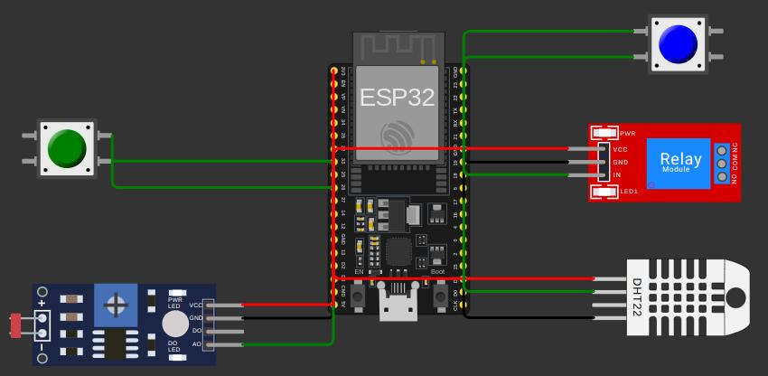

Aqui está a reescrita com as informações adicionais:

---

O diagrama Wokwi descreve um circuito que simula o monitoramento de nutrientes no solo e controle de irrigação, utilizando componentes como botões, sensores e um relé. A seguir, explicamos a função de cada componente e suas conexões:

### Funções dos Componentes:
- **Botão Verde**: Simula a medição da presença ou ausência de fósforo no solo (indicando concentração suficiente ou insuficiente do insumo).
- **Botão Azul**: Simula a medição da presença ou ausência de potássio no solo (indicando concentração suficiente ou insuficiente do insumo).
- **Sensor DHT22**: Mede a umidade do solo para indicar a necessidade de irrigação.
- **LDR (Fotoresistor)**: Simula a medição de pH do solo (um valor analógico que pode ser interpretado como a acidez do solo).
- **Módulo Relé**: Simula o acionamento da bomba d'água, utilizada para irrigação, caso a lógica de irrigação determine necessidade de água no solo.

### Conexões dos Pinos:
  
1. **Botão Verde (btn1)** (Simula Fósforo):
   - **Terminal 1 (r)** → **Pino 26** do ESP32
   - **Terminal 2 (r)** → **GND** do ESP32

2. **Botão Azul (btn2)** (Simula Potássio):
   - **Terminal 1 (l)** → **Pino 22** do ESP32
   - **Terminal 2 (l)** → **GND** do ESP32

3. **Sensor DHT22 (dht1)** (Mede Umidade do Solo):
   - **GND** → **GND** do ESP32
   - **VCC** → **3.3V** do ESP32
   - **SDA** → **Pino 17** do ESP32

4. **LDR (ldr1)** (Simula pH do Solo):
   - **VCC** → **5V** do ESP32
   - **GND** → **GND** do ESP32
   - **AO (Saída Analógica)** → **Pino 35** do ESP32

5. **Módulo Relé (relay1)** (Simula Controle da Bomba d'Água):
   - **VCC** → **5V** do ESP32
   - **GND** → **GND** do ESP32
   - **IN (Controle)** → **Pino 21** do ESP32

---

Essas conexões formam um sistema que pode ser utilizado para simular o monitoramento de nutrientes e umidade do solo, além de controlar a irrigação automaticamente por meio de um relé acionado pela lógica do código no ESP32.

